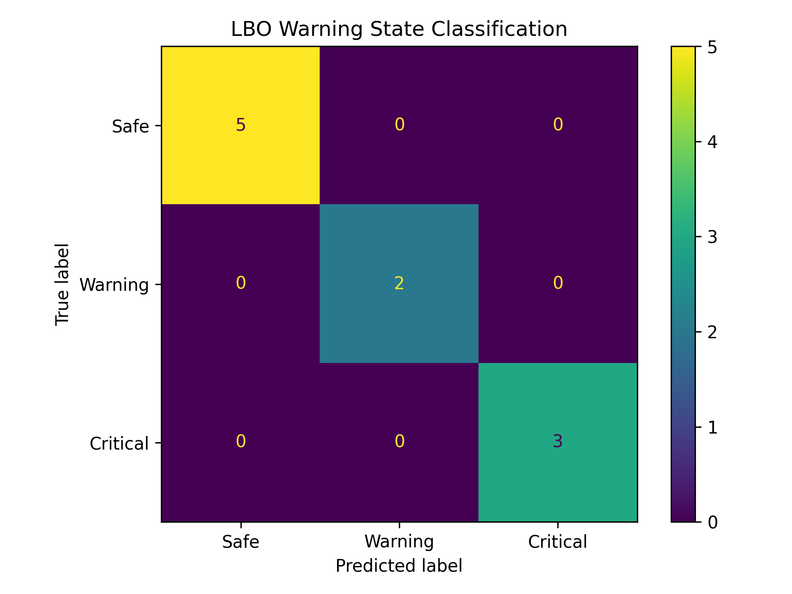
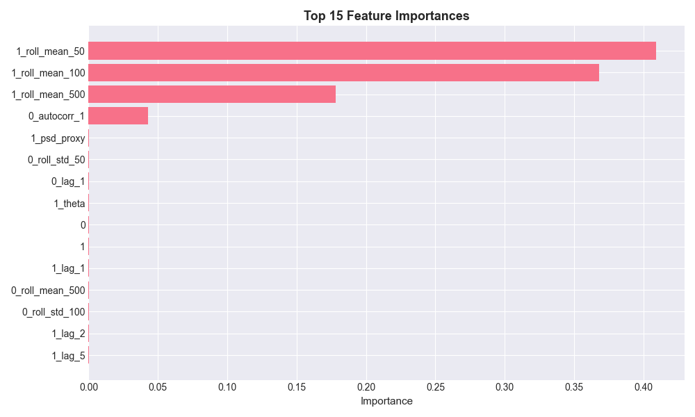

# Lean Blowout Prediction Using Machine Learning

## Abstract

Lean Blowout (LBO) is a critical combustion instability that occurs when the fuel-air mixture becomes too lean to sustain stable combustion. Early prediction of LBO can improve combustor safety, efficiency, and operational reliability.

This project develops a machine learning framework for predicting combustion stability using pressure sensor signals collected under multiple operating conditions. Time-domain and physics-inspired features were extracted from the sensor data and used to train an XGBoost regression model. The model predicts the normalized equivalence ratio (Φ/ΦLBO) and classifies operating conditions into Safe, Warning, and Critical states.

The final model achieved an average prediction error of 2.44% and correctly classified all operating conditions into their respective warning states.

---

# 1. Introduction

Lean combustion is widely used to reduce emissions and improve efficiency in modern combustion systems. However, operating near lean conditions increases the risk of Lean Blowout (LBO), where the flame becomes unstable and extinguishes.

Detecting proximity to LBO before complete flame extinction is therefore important for safe combustor operation.

Traditional methods use combustion instability indicators such as:

- Normalized Root Mean Square (NRMS)
- Probability Density Function (PSD)
- Theta parameter
- Autocorrelation

This work combines these concepts with machine learning to estimate combustion stability directly from pressure sensor measurements.

---

# 2. Dataset

## Operating Conditions

The dataset consists of pressure sensor measurements collected under multiple proprietary operating conditions spanning stable combustion to lean blowout conditions.
To comply with data confidentiality requirements, exact operating parameters and raw measurements are not included in this report.

---

# 3. Feature Engineering

Several features were extracted from the raw sensor signals.

## Statistical Features

- Rolling Mean (50)
- Rolling Mean (100)
- Rolling Mean (500)
- Rolling Standard Deviation
- Signal Difference
- Lag Features

## Physics-Based Features

### NRMS

Normalized Root Mean Square:

NRMS = Rolling Standard Deviation / Rolling Mean

Used as a combustion instability indicator.

### Theta

Theta measures the fraction of samples below a threshold value and provides information about flame stability.

### Autocorrelation

Autocorrelation captures repeating oscillatory behavior within the pressure signal.

### PSD Proxy

A power spectral density approximation based on rolling variance.

---

# 4. Machine Learning Model

Model:

XGBoost Regressor

Target Variable:

Φ/ΦLBO

The model was trained to estimate the normalized distance from lean blowout.

---

# 5. Validation Method

Leave-One-Condition-Out validation was performed.

Procedure:

1. Hold out one operating condition.
2. Train on the remaining nine conditions.
3. Predict the held-out condition.
4. Repeat for all ten operating conditions.

This approach evaluates generalization to unseen operating conditions.

---

# 6. Results

## Regression Performance

Average Prediction Error:

2.44%

Average Mean Absolute Error:

0.0331

## State Classification

Three operating regions were defined:

| State | Condition |
|---------|---------|
| Safe | Φ/ΦLBO > 1.05 |
| Warning | 1.025 < Φ/ΦLBO <= 1.05 |
| Critical | Φ/ΦLBO <= 1.025 |

Classification Results:

| State | Correct Predictions |
|---------|---------|
| Safe | 5/5 |
| Warning | 2/2 |
| Critical | 3/3 |

Overall State Accuracy:

100%

## Figure 1 - State Classification

---

# 7. Important Features

Feature importance analysis showed that the model relied primarily on:

1. Rolling Mean (50)
2. Rolling Mean (100)
3. Rolling Mean (500)
4. Autocorrelation
5. PSD Proxy

These features are physically meaningful and correspond to known combustion stability indicators.
### Figure 2. Feature Importance

The model relies primarily on rolling mean statistics and autocorrelation-based features.
---

# 8. Discussion

The model demonstrated strong predictive performance despite being trained on a relatively small number of operating conditions.

The inclusion of physics-inspired features improved interpretability and ensured that model predictions remained linked to known combustion behavior.

The results suggest that machine learning can be used as an effective tool for estimating proximity to lean blowout from pressure sensor measurements.

---

# 9. Conclusion

A machine learning framework for lean blowout prediction was developed using pressure sensor data.

The final XGBoost model achieved:

- 2.44% average prediction error
- 100% state classification accuracy

The model successfully distinguished Safe, Warning, and Critical operating conditions and demonstrated the feasibility of data-driven combustion stability monitoring.
